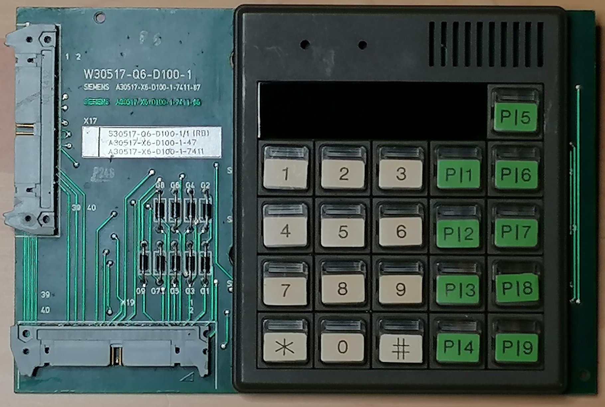

# MC1000

__Table of content__

- [System](#system)
- [Hardware](#hw)
- [Mainboard](#pcb)
- [Keyboard](#kbd)

## System

The MC1000 is an letter shoot or pneumatic delivery (german "Rohpost") on a Intel 8039 CPU. The **MC1000** are developed and destributed from 1982 until end of the 80th.

These repository will be stay for all homebrew software for these PCB like an Arduino. 

[Top](#system)

## Hardware
- [INTEL 8039](Datasheet/8039/INTEL_8048.pdf) 8bit CPU
- [INTEL 8251](Datasheet/8251/intel_8251.pdf) UART
- [INTEL 8279](Datasheet/8279/INTEL_8279.pdf) Keyboard/Display Interface
- Program on 2716/2732 EPROM
- Program memory extendible to additional 2716/2732 EPROM
- 2 x [INTEL 8243](Datasheet/8243/INTEL_8243.pdf) Input/Output Expander
- 4 digit 7 segment Display
- 12 keys Keyboard (0-9,*,#)
- 20 GPIO Input ports by opto-isolator
- 17 GPIO output ports by opto-isolator

[Top](#system)

## Mainboard

[Top](#system)

## Keyboard

[Top](#system)

