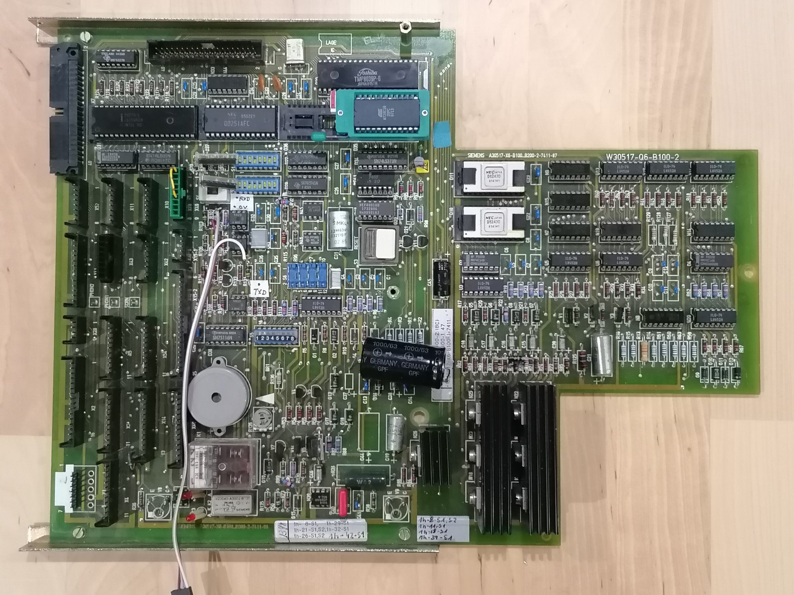

# MC1000

__Table of content__

- [System](#system)
- [Hardware](#hw)
- [Mainboard](#pcb)
- [Keyboard](#kbd)
- [GPIO](#gpio)

## System

The MC1000 is an letter shoot or pneumatic delivery (german "Rohrpost") on a Intel 8039 CPU. The **MC1000** are developed and destributed from 1982 until end of the 80th.

These repository will be stay for all homebrew software for these PCB like an Arduino. 

[Top](#system)

## Hardware
- [INTEL 8039](Datasheet/8039/INTEL_8048.pdf) 8bit CPU
- [INTEL 8251](Datasheet/8251/intel_8251.pdf) UART
- [INTEL 8279](Datasheet/8279/INTEL_8279.pdf) Keyboard/Display Interface
- Program on 2716/2732 EPROM
- Program memory extendible to additional 2716/2732 EPROM
- 2 x [INTEL 8243](Datasheet/8243/INTEL_8243.pdf) Input/Output Expander
- 4 digit 7 segment Display
- 12 keys Keyboard (0-9,*,#)
- 20 GPIO Input ports by opto-isolator
- 17 GPIO output ports by opto-isolator

[Top](#system)

## Mainboard

[Top](#system)

## Keyboard

[Top](#system)

## GPIO

[Top](#system)

| IC | GPIO | Direction | Homebrew | Origin | Connector                           | Remark                                    |
| :--- | :------- | ---- | :------------------------------------------- | -------------------------------------------- | :------------------------------------------- | -------------------------------------------- |
| uC 8039 | P10  | Bidirectional | SDA | 2114-A8 | X44:15 | A8 RAM Expansion Board |
| uC 8039   | P11  | Bidirectional | SCL | 2114-A9 | X44:16 | A9 RAM Expansion Board |
| uC 8039   | P12  |Bidirectional|          |      | X44:21 | RAM Expansion Board |
| uC 8039   | P13  |Output| C/D | C/D | X44:35 | Command/Data all IO |
| uC 8039   | P14  | Output | IO_Reset | IO_Reset | X44:34 | Reset all IO |
| uC 8039   | P15  | Output | CS 8279 | CS 8279 |                                              | CS Keyboard Mainboard |
| uC 8039   | P16  | Output | CS 8251 | CS 8251 |                                              | CS UART Mainboard |
| uC 8039   | P17  |Output|          | CS 8251 | X44:36 | CS UART Expansion Board |
|  |  | | | | | |
| uC 8039   | P20  |Bidirectional| A0 8243 | A0 8243 |  | Adress/Control bit 8243 |
| uC 8039   | P21  |Bidirectional| A1 8243 | A1 8243 |  | Adress/Control bit 8243 |
| uC 8039   | P22  |Bidirectional| A2 8243 | A2 8243 |  | Adress/Control bit 8243 |
| uC 8039   | P23  |Bidirectional| A3 8243 / D35-A11 | A3 8243 |  | Adress/Control bit 8243 & A11 EPROM 2732/2716 #1 |
| uC 8039   | P24  |Output| /CS D35/D36 | /CS D35/D36 |  | /CS EPROM 2732/2716 #1 & /CS EPROM 2732/2716 #2 |
| uC 8039   | P25  |Output| D36-A11 | D36-A11 |  | A11 EPROM 2732/2716 #2 |
| uC 8039   | P26  |Output| /CS 8243 | /CS 8243 |  | CS Portexpander D10 & D11 |
| uC 8039   | P27  |Output| Watchdog | Watchdog |  | Must be triggered at least within 3 seconds. |
|  |  |  |  | |  |  |
|  D11_-_8243  | P40  | Input |          |      |                                              |                                              |
|  D11-8243  | P41  | Input |          |      |                                              |                                              |
|  D11-8243  | P42  | Input |          |      |                                              |                                              |
|  D11-8243  | P43  | Input |          |      |                                              |                                              |
|  D11-8243  | P50  | Output |          |      |                                              |                                              |
|  D11-8243  | P51  | Output |          |      |                                              |                                              |
|  D11-8243  | P52  | Output |          |      |                                              |                                              |
|  D11-8243  | P53  | Output |          |      |                                              |                                              |
|  D11-8243  | P60  | Output |          |      |                                              |                                              |
|  D11-8243  | P61  | Output |          |      |                                              |                                              |
|  D11-8243  | P62  | Output |          |      |                                              |                                              |
|  D11-8243  | P63  | Output |          |      |                                              |                                              |
|  D11-8243  | P70  | Output |          |      |                                              |                                              |
|  D11-8243  | P71  | Output |          |      |                                              |                                              |
|  D11-8243  | P72  | Output |          |      |                                              |                                              |
|  D11-8243  | P73  | Output |          |      |                                              |                                              |
|  |  |  |  | |  |  |
|  D10-8243  | P40  | Input |          |      |                                              |                                              |
|  D10-8243  | P41  | Input |          |      |                                              |                                              |
|  D10-8243  | P42  | Input |          |      |                                              |                                              |
|  D10-8243  | P43  | Input |          |      |                                              |                                              |
|  D10-8243  | P50  | Input |          |      |                                              |                                              |
|  D10-8243  | P51  | Input |          |      |                                              |                                              |
|  D10-8243  | P52  | Input |          |      |                                              |                                              |
|  D10-8243  | P53  | Input |          |      |                                              |                                              |
|  D10-8243  | P60  | Output |          |      |                                              |                                              |
|  D10-8243  | P61  | Output |          |      |                                              |                                              |
|  D10-8243  | P62  | Output |          |      |                                              |                                              |
|  D10-8243  | P63  | Output |          |      |                                              |                                              |
|  D10-8243  | P70  | Output |          |      |                                              |                                              |
|  D10-8243  | P71  | Output |          |      |                                              |                                              |
|  D10-8243  | P72  | Output |          |      |                                              |                                              |
|  D10-8243  | P73  | Output |          |      |                                              |                                              |
|  |  |  |  | |  |  |
